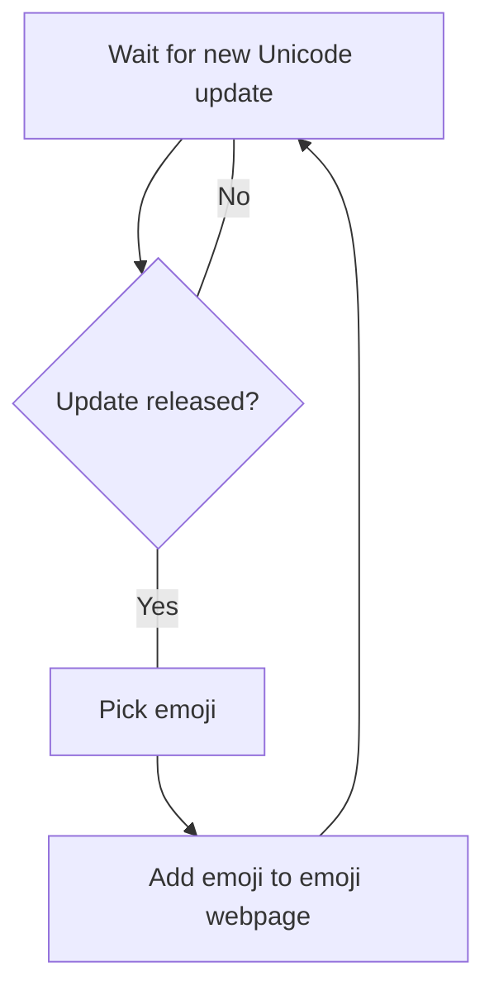

# Mermaid Graphinator

Get the graph by itself at [graphinator.mmd](graphinator.mmd)

```mermaid
graph TD
    A[Wait for new Unicode update] --> B
    B{Update released?} -- No --- A
    B -- Yes --- C[Pick emoji]
    C --> D[Add emoji to emoji webpage]
    D --> A
```
