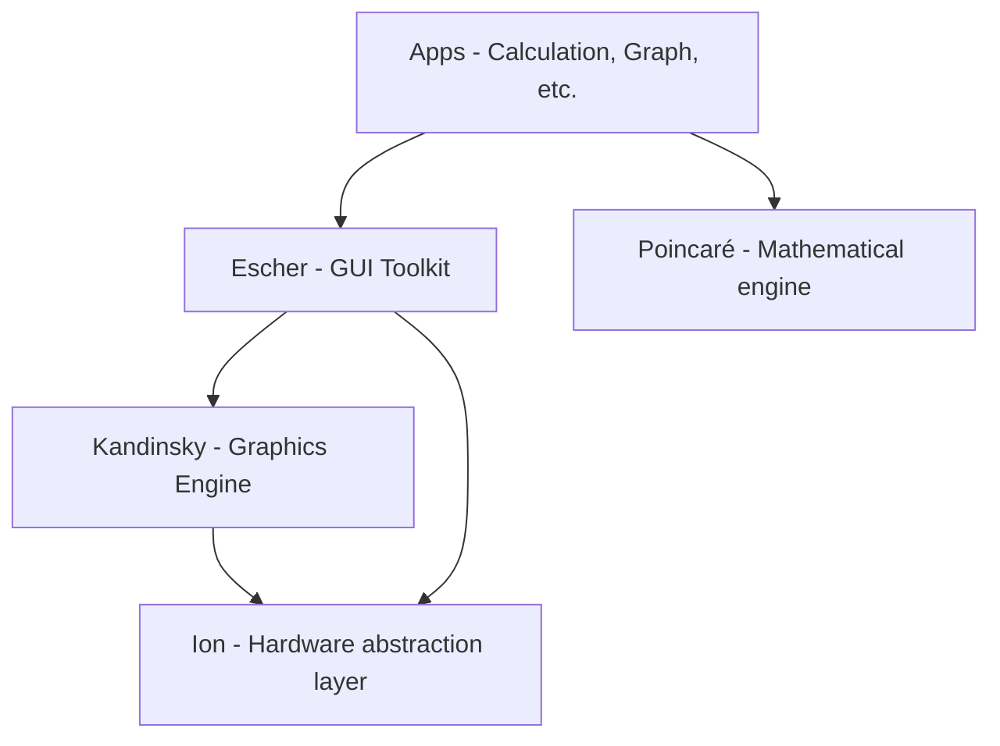

# Mermaid Graphinator

> Idea from [NumWorks](https://www.numworks.com/resources/engineering/software/#discover-epsilons-architecture)

Get the graph by itself at [graphinator.mmd](graphinator.mmd)

